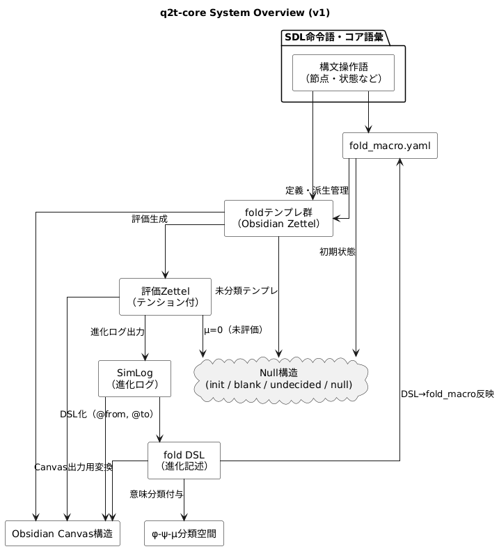

# fold_dsl-demo-vault インデックス

このVaultは、fold_dslシステムの導入例として構成されています。

## 🔗 構成リンク

- 🌱 [導入ガイド](docs/ZdZ_fold_dsl-guide-v1.md)
- 📘 [DSL仕様書](docs/ZdZ_fold_dsl-spec-v1.md)
- 📦 [構造ログ](docs/ZdZ_fold_dsl-macroflows-v1.md)
- 🧠 [fold_macro.yaml](fold_macro.yaml)
- 🎯 [評価テンプレ](./_zettel/templates/eval_contrast_cause.md)
- 🧩 [SimLog構造](./_fold/simlog/simlog_reasoning.yaml)
- 🖼 [Canvas構造](./_fold/canvas/fold_canvas_contrast.json)

---
## 🧭 q2t-core システム構成図（v1）

下図は、q2t-core における中核構造の関係を視覚化したものです。fold_macro.yaml を中心に、テンプレート群・評価・進化ログ・DSL記述・Canvas構造との連動関係がひと目で把握できます。

➡ より詳しい構造解説や更新履歴については [構造オーバービューページ](./q2t_structure-overview.md) を参照してください。

---
## φ–ψ–μ 構造

| 空間 | フォルダ | 内容 |
|------|---------|------|
| φ（思考） | `_zettel/` | 評価Zettel、ノード |
| ψ（構造） | `_fold/` + `fold_macro.yaml` | テンプレ構造・系列 |
| μ（操作） | `_config/` | スクリプト・QuickAdd |
